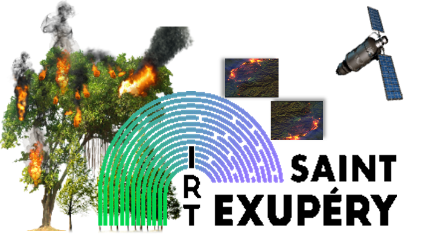
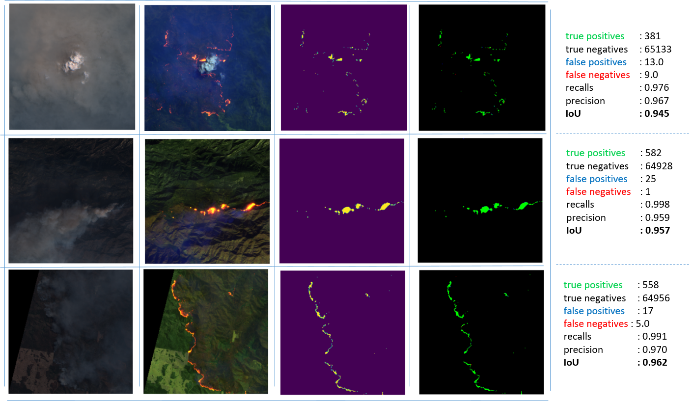

<H1 align="center" style="color:darkviolet"> SENTINEL2 FOREST FIRES DETECTION </H1>


<p align="center">
<br>
</p>

## Demo using a deep learning model to detect forest fires using sentinel-2 multi-spectral satellite imagery

<div id="top"></div>


<p align="center">
<br>
</p>


<!-- TABLE OF CONTENTS -->
<details>
  <summary>Table of Contents</summary>
  <ol>
    <li><a href="#about-this-repository-">About This Repository</a></li>
    <li>
      <a href="#getting-started">Getting Started</a>
    </li>
    <li>
        <a href="#usage-">Usage</a>
        <ul>
            <li><a href="#demo-running">Demo running</a></li>
            <li><a href="#data_structure">Data structure</a></li>
        </ul>
    </li>
    <li><a href="#license-">License</a></li>
    <li><a href="#contact-">Contact</a></li>
    <li><a href="#references-">References</a></li>
  </ol>
</details>


<!-- ABOUT THE PROJECT -->

## About This repository 💼

This git repository contains a demonstration of active forest fire detection with a deep learning model. The demo
consists of showing you how to load the model and make the inference on some sample images.


### This demo is built with :

* [Anaconda](https://www.anaconda.com/products/distribution)
* [Python](https://www.python.org/)
* [tensorflow](https://www.tensorflow.org/)
* [skimage](https://scikit-image.org/)
* [matplotlib](https://matplotlib.org/)
* [NumPy](https://numpy.org/)

<p align="right">(<a href="#top">back to top</a>)</p>


<!-- GETTING STARTED -->

## Getting Started

Follow these instructions to locally setup up your project.


- Clone the repo

  ```sh
  git clone "https://github.com/hxfdanger/S2WDS.git"
  
  cd S2WDS/
  ```


- Create the dedicated python environment using the S2WDS_env.yml file

   ```sh
   conda env create -f S2WDS_env.yml
   ```
- Activate it:
  ```sh
     conda conda activate S2WDS
  ```

🚨 To install the conda environment run
this (to run conda command you have to install [Anaconda distribution](https://www.anaconda.com/products/distribution))

🚨 The model **wildfire_Unet_MobileNetv3_model_40m.h5** used in the demo does not exist in this repository. you can
download it [__here__](https://ciar.irt-saintexupery.com/index.php/s/NDXrX4eRKzkIPWD/download?path=%2F&files=wildfire_Unet_MobileNetv3_model_40m.h5). 
And you have to put it in a folder called model.


<p align="right">(<a href="#top">back to top</a>)</p>


<!-- USAGE EXAMPLES -->

## Usage 📒

### 1. Demo running

The jupyter nootebook is not installed in the S2WDS env created by <a href="#prerequisites">S2WDS_env.yml </a> file.

🚨 To run the notebook **demo.ipynb** you have to install **jupyter** package in your active (S2WDS) environment
```conda install -c anaconda jupyter```

🏁 Run the notebook [**demo.ipynb**](https://github.com/hxfdanger/S2WDS/blob/prepare_demo/demo.ipynb)

```bash
jupyter notebook demo.ipynb
```

**✍ NOTES:**

- [**Demo.ipynb**](https://github.com/hxfdanger/S2WDS/blob/prepare_demo/demo.ipynb) will use some function declared in
  utils.py
- All images used for the demo are located in data folder. The structure of the data described
  (<a href="#data_structure">bellow</a>).

### <div id="data_structure"> 2. Data structure</div>

```
./data/
├── false_color
│      ├── _Sentinel-2 L1C from 2017-12-08_SantaBarbara_BANDS-S2-L1C_0_5.tif
│      ├── _Sentinel-2 L1C from 2018-08-16_Mendocino_BANDS-S2-L1C_0_5.tif
│      └── _Sentinel-2 L1C from 2019-11-12_PortMacquarie2_BANDS-S2-L1C_0_77.tif
├── image_distribution
│      ├── test.txt
│      ├── train.txt
│      └── val.txt
├── masks
│      ├── _Sentinel-2 L1C from 2017-12-08_SantaBarbara_BANDS-S2-L1C_0_5.tif
│      ├── _Sentinel-2 L1C from 2018-08-16_Mendocino_BANDS-S2-L1C_0_5.tif
│      └── _Sentinel-2 L1C from 2019-11-12_PortMacquarie2_BANDS-S2-L1C_0_77.tif
└── RGB
       ├── _Sentinel-2 L1C from 2017-12-08_SantaBarbara_BANDS-S2-L1C_0_5.tif
       ├── _Sentinel-2 L1C from 2018-08-16_Mendocino_BANDS-S2-L1C_0_5.tif
       └── _Sentinel-2 L1C from 2019-11-12_PortMacquarie2_BANDS-S2-L1C_0_77.tif
```
**✍ NOTES:**

- The data folder only contains some examples used to run the demo
- **false_color** folder contains 3 images composed by [B12,B11,B04] (sentinel2 bands) used as the input of the model for inference. 
- **RGB** contains 3 images corrsponding to false_color images composed by [B04,B03,B02] (sentinel2 bands) used only for visualizing.
- **masks** folder contains 3 binary masks (**value : 0=no-fire; value : 1=fire**) corresponding to the images in the false_color folder.
- Image_distribution folder contains 3 files :
  - train.txt : (empty) 
  - val.txt : (empty)
  - test.txt : contains the name of 3 images used for the inference
- To download all the data ([link](https://ciar.irt-saintexupery.com/index.php/s/NDXrX4eRKzkIPWD))
- For more information about the data ([link]())

<p align="right">(<a href="#top">back to top</a>)</p>


<!-- LICENSE -->

## License 📑


Distributed under the Attribution 4.0 International (CC BY 4.0) License. 

Contains modified Copernicus Sentinel data [2016-2020] processed by Sentinel Hub

<p align="right">(<a href="#top">back to top</a>)</p>


<!-- CONTACT -->

## Contact 📭

* [Houssem FARHAT 📧](mailto:houssem.farhat@irt-saintexupery.com)
* [Lionel DANIEL 📧](mailto:lionel.daniel@irt-saintexupery.com)
* [Michael BENGUIGUI 📧](mailto:michael.benguigui@irt-saintexupery.com)
* [Adrien GIRARD 📧](mailto:adrien.girard@irt-saintexupery.com)


Project Link: [https://github.com/hxfdanger/S2WDS/](https://github.com/hxfdanger/S2WDS/)

<p align="right">(<a href="#top">back to top</a>)</p>


<!-- REFERENCES -->

## References 🔗 

<ol>
<li>
<div id="ref-FARHAT:2022" class="csl-entry" role="doc-biblioentry">
Houssem Farhat, Michael Benguigui, Lionel Daniel. 2022. <span>“Mod<span>è</span>le Et Jeu de Donn<span>é</span>es Pour La d<span>é</span>tection Multi-Spectrale de Feux de Forêt <span class="nocase">à</span> Bord de Satellites.”</span> In <em>PFIA 2022 - CNIA</em>, 1–8. Angers, France. <a href="">paper link</a>.
</div>
</li>
</ol>


<p align="right">(<a href="#top">back to top</a>)</p>
